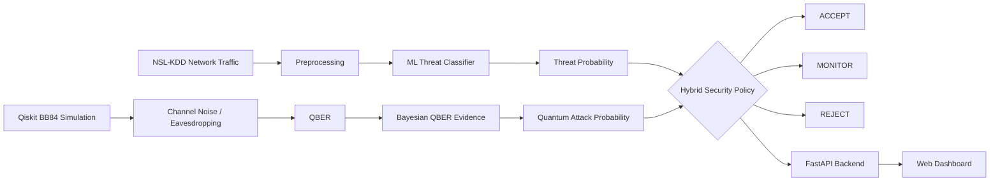

# QSafe

### Threat-Aware Quantum-Secure Communication for Biomedical Networks


> QSafe decides **whether a communication session can be trusted** by combining two signals that are usually treated separately: how *suspicious the network traffic looks* (classical ML) and how *clean the quantum key exchange was* (BB84 + QBER).

---

## Table of Contents

1. [Problem Statement](#1-problem-statement)
2. [Our Solution](#2-our-solution)
3. [System Architecture](#3-system-architecture)
4. [How Each Module Works](#4-how-each-module-works)
5. [Tech Stack](#5-tech-stack)
6. [Project Structure](#6-project-structure)
7. [Getting Started](#7-getting-started)
8. [Usage](#8-usage)
9. [Results and Evaluation](#9-results-and-evaluation)
10. [Limitations](#10-limitations)
11. [Future Work](#11-future-work)
12. [Hackathon Details](#12-hackathon-details)
13. [Team](#13-team)
14. [License](#14-license)

---

## 1. Problem Statement

Biomedical networks (hospitals, diagnostic labs, remote patient-monitoring systems) move some of the most sensitive data that exists: patient records, genomic data, and device telemetry. Two problems threaten this traffic:

- **Future cryptographic risk.** Data encrypted today with classical key exchange can be recorded now and decrypted later once quantum computers mature ("harvest now, decrypt later"). Medical data stays sensitive for decades, so this matters more here than in most domains.
- **Present-day network attacks.** Quantum Key Distribution (QKD) protects the *key exchange*, but it does nothing about a compromised or malicious host on the network. Likewise, an intrusion detector says nothing about whether a quantum channel is being eavesdropped.

Most systems address one of these. A communication session is only trustworthy if **both** the network behaviour and the key exchange look healthy.

## 2. Our Solution

QSafe is a hybrid cybersecurity and quantum communication system that:

- Analyses network traffic from the **NSL-KDD** dataset and classifies it as normal or attack, producing a **threat probability**
- Simulates **BB84 Quantum Key Distribution** using **Qiskit**
- Simulates **quantum channel noise** and **eavesdropping**, and measures the **Quantum Bit Error Rate (QBER)**
- Converts QBER into a **quantum attack probability** with a Bayesian evidence model, then fuses it with the network threat probability in a **hybrid security policy** that outputs one of three decisions: **ACCEPT**, **MONITOR**, or **REJECT**
- Exposes everything through a **FastAPI backend** and a **web dashboard**

## 3. System Architecture



In plain text:

```
NSL-KDD -> LightGBM Threat Classifier -> Threat Probability --------------+
                                                                          |
Qiskit BB84 -> Noise / Eve -> QBER -> Bayesian Evidence -> Attack Prob. --+--> Hybrid Policy
                                                                                 -> ACCEPT / MONITOR / REJECT
                                                                                 -> FastAPI -> Web Dashboard
```

## 4. How Each Module Works

### 4.1 Classical Threat Analysis (`ml/`)

- Uses the **NSL-KDD** intrusion detection dataset (an improved version of KDD'99 with duplicate records removed).
- **Data:** trained on the official **KDDTrain+** split (125,973 rows) and evaluated on **KDDTest+** (22,544 rows), using 41 features. Labels are mapped to a binary target (normal = 0, attack = 1).
- **Dataset audit:** schema, missing values, duplicates, train/test feature consistency, label distribution, and categorical compatibility were checked. KDDTest+ contains attack types that never appear in KDDTrain+, so the official test set measures generalisation to unseen attacks, not just random hold-out performance.
- **Classification:** a binary classifier separates *normal* from *attack* traffic and outputs a **probability**, not just a label, so the decision engine can treat borderline traffic differently from clearly malicious traffic.
- **Models compared:** Logistic Regression, Random Forest, Extra Trees, HistGradientBoosting, CatBoost, XGBoost, and LightGBM.
- **Final runtime model: LightGBM**, stored as `models/threat_model_best.joblib` with its decision threshold and configuration in `models/threat_model_info.json`.
- **Runtime predictor** (`ml/predict.py`) loads the model and threshold, restores the expected categorical types for `protocol_type`, `service`, and `flag`, and returns the predicted label, the threat probability, and the threshold used. It is wrapped by `backend/services/threat_service.py`.

### 4.2 Quantum Key Distribution (`quantum/`)

QSafe simulates the **BB84 protocol** with Qiskit and Qiskit Aer:

1. **Alice** generates random bits and random measurement bases, and encodes each bit as a qubit.
2. The qubit passes through a **simulated quantum channel**: an identity gate with a **depolarizing noise model** (Qiskit Aer) attached, controlled by `noise_rate`.
3. For each qubit, an **eavesdropper (Eve)** attacks with probability `eve_probability`. Eve performs an **intercept-and-resend attack**: she measures in a randomly chosen basis, destroys the original qubit, and sends Bob a fresh qubit prepared from her result. When Eve attacks, the qubit crosses two noisy channel legs (Alice to Eve, Eve to Bob).
4. **Bob** measures each qubit in a randomly chosen basis.
5. **Sifting:** Alice and Bob keep only the positions where their bases matched.
6. **QBER:** the fraction of sifted positions where Alice's and Bob's bits disagree. In the simulation it is computed over the whole sifted key.

All random choices use Python's `secrets` module, so results differ slightly from run to run.

The main entry point is `run_bb84(n_bits, noise_rate, eve_probability)`, which returns Alice's and Bob's bits and bases, both sifted keys, and the QBER.

| File | Role |
|---|---|
| `quantum/bb84.py` | Core BB84 logic (`run_bb84`) plus a quick Eve-sweep demo |
| `quantum/channel.py` | Depolarizing noise model for the channel |
| `quantum/eve.py` | Intercept-and-resend circuit |
| `quantum/experiment_runner.py` | Full experiment sweep; writes `experiments/qkd_experiment_results.csv` |
| `quantum/qber_model.py` | Bayesian QBER evidence model |

**Why QBER matters:** a clean channel gives a QBER near zero. Channel noise raises it modestly, while intercept-and-resend raises it in proportion to how much Eve listens: theoretically about 25% of the sifted key when she attacks every qubit, so roughly `25% x eve_probability`. A high QBER means the key cannot be trusted, and the session should not proceed on it.

#### Statistical QBER evidence model

Rather than relying on a single hard cutoff, QSafe asks: *given the QBER we observed, how likely is it that someone is listening?*

- Two hypotheses are compared: **H0** (honest noisy channel) and **H1** (channel under eavesdropping).
- The expected QBER and its spread for each hypothesis are **calibrated from the experiment results** (`experiments/qkd_experiment_results.csv`), using the closest measured noise / Eve configuration.
- The observed QBER is scored under both hypotheses using Gaussian likelihoods, giving a **likelihood ratio** (above 1 favours eavesdropping) and, through Bayes' rule with a configurable prior (default 50%), a **posterior probability that Eve is present**.
- Inputs: observed QBER, estimated channel noise, a representative Eve attack strength (default 10%), and the prior.

The backend uses a representative attack hypothesis of **10% Eve probability** and a **50% prior**. The true simulated Eve probability is never handed to the detector as a result: the detector only sees the observed QBER and judges it with this statistical model.

### 4.3 Adaptive Security Policy (`decision/`)

The decision engine (`decision/policy.py`, orchestrated by `backend/services/hybrid_service.py`) uses these signals:

| Input | Source |
|---|---|
| Threat probability | LightGBM classifier on network traffic |
| Observed and expected QBER | BB84 simulation and channel model |
| Quantum attack probability | Bayesian QBER evidence model |
| Channel conditions | Noise / eavesdropping simulation settings |

and returns one of:

| Decision | Meaning |
|---|---|
| **ACCEPT** | Both security layers look healthy. |
| **MONITOR** | The session carries a moderate or ambiguous signal, or a strong network signal with a clean quantum channel. Treat it cautiously. |
| **REJECT** | Strong evidence that the session should not proceed (high quantum threat, or high network and quantum threat together). |

**Current thresholds** (probabilities):

| Signal | Low below | High above |
|---|---|---|
| Network threat | 0.40 | 0.70 |
| Quantum attack | 0.40 | 0.80 |

**Decision rules:**

| Condition | Decision |
|---|---|
| High network threat + high quantum threat | REJECT |
| High network threat only | MONITOR |
| High quantum threat only | REJECT |
| Medium network threat + medium quantum threat | MONITOR |
| Medium quantum threat | MONITOR |
| Medium network threat | MONITOR |
| Low network threat + low quantum threat | ACCEPT |

Because the policy uses both signals together, it catches cases that either one would miss alone. For example, benign network traffic over a compromised quantum channel is **REJECTED**, while malicious traffic over a clean quantum channel is **MONITORED** instead of passing silently.

### 4.4 Backend and Dashboard (`backend/`, `frontend/`)

**Backend.** A FastAPI service wraps the classifier, the BB84 simulation, the evidence model, and the policy (`backend/services/`: `threat_service`, `qkd_service`, `decision_service`, `hybrid_service`, `demo_service`).

| Endpoint | Purpose |
|---|---|
| `GET /api/health` | Backend health check |
| `POST /api/threat` | Run the classical threat classifier |
| `POST /api/security` | Evaluate a provided security state |
| `POST /api/analyze` | Run the full network + QKD + policy pipeline |
| `POST /api/demo` | Run a predefined demonstration scenario |

`/api/analyze` is the main endpoint. It takes the 41 NSL-KDD features, the number of BB84 bits and trials, the channel noise rate, and the Eve probability, and returns three blocks: `threat`, `quantum`, and `decision`.

`/api/demo` offers five predefined modes backed by stored NSL-KDD test samples in `backend/demo_samples.json`, so the demo is reproducible without typing 41 features: `NORMAL`, `NOISY_CHANNEL`, `NETWORK_ATTACK`, `EAVESDROPPER`, `COMBINED_ATTACK`.

**Dashboard.** A browser app in plain HTML, CSS, JavaScript and SVG (no framework) that consumes real backend results, not hardcoded scenario numbers. It shows:

- Person A, Person B, and an animated quantum channel between them
- Live threat probability, QBER, expected QBER, and quantum attack probability
- The ACCEPT / MONITOR / REJECT decision state, with scenario controls and session history
- Charts for QBER vs noise, QBER vs Eve, threat probability vs QBER, evidence comparison, and decision distribution
- A guardian-dragon visual tied to the decision: calm for ACCEPT, irritated with a controlled channel wave for MONITOR, and furious with fire and a chaotic channel for REJECT
- Multiple visual themes (for example Quantum Core, Cyber Neon, Clinical Secure)

## 5. Tech Stack

| Area | Tools |
|---|---|
| Quantum computing | Qiskit, Qiskit Aer, Qiskit IBM Runtime |
| Machine learning | scikit-learn, XGBoost, LightGBM (final runtime model), CatBoost, joblib |
| Scientific computing | NumPy, SciPy, pandas |
| Network / graph analysis | NetworkX |
| Visualisation | Matplotlib, Plotly |
| Backend | FastAPI, Uvicorn, Pydantic, HTTPX |
| Frontend | HTML, CSS, JavaScript, SVG (no framework) |
| Dev environment | Python 3.11, Jupyter, VS Code |

## 6. Project Structure

```
QSafe/
├── backend/
│   ├── api/routes.py            # API routes
│   ├── services/                # threat, qkd, decision, hybrid, demo services
│   ├── demo_samples.json        # NSL-KDD samples for demo scenarios
│   └── main.py                  # FastAPI app
├── quantum/
│   ├── bb84.py                  # BB84 implementation
│   ├── channel.py               # Depolarizing noise model
│   ├── eve.py                   # Intercept-and-resend Eve
│   ├── qber_model.py            # Bayesian QBER evidence model
│   ├── experiment_runner.py     # Repeated QBER experiments -> CSV
│   └── experiments/             # Quantum experiment outputs
├── ml/
│   ├── predict.py               # Runtime predictor
│   └── train.py                 # Model training
├── decision/
│   └── policy.py                # Hybrid security policy
├── models/
│   ├── threat_model_best.joblib # Final LightGBM model
│   └── threat_model_info.json   # Threshold / configuration
├── data/
│   ├── raw/                     # KDDTrain+.txt, KDDTest+.txt
│   └── processed/
├── experiments/
│   └── qkd_experiment_results.csv
├── frontend/                    # index.html, style.css, app.js, channel-flow.js, ambient-field.js, assets/
├── scripts/
├── tests/
├── notebooks/
├── docs/
├── requirements.txt
├── .env.example
├── .gitignore
└── LICENSE
```

## 7. Getting Started

### Prerequisites

- Python **3.11**
- Git
- (Optional) An IBM Quantum account, only if you want to use Qiskit IBM Runtime

### Installation

```bash
# 1. Clone the repository
git clone https://github.com/qtysjin7107/QSafe.git
cd QSafe

# 2. Create and activate a virtual environment
python3.11 -m venv .venv
source .venv/bin/activate        # Windows: .venv\Scripts\activate

# 3. Install dependencies
pip install -r requirements.txt

# 4. Configure environment variables
cp .env.example .env             # Windows: copy .env.example .env
# then edit .env with your values
```

### Dataset

QSafe uses the **NSL-KDD** dataset. Place the files here:

```
data/raw/KDDTrain+.txt
data/raw/KDDTest+.txt
```

The final trained model is already committed in `models/threat_model_best.joblib` and `models/threat_model_info.json`, so the backend and dashboard run **without retraining**. The dataset is only needed if you want to retrain with `python -m ml.train`.

## 8. Usage

Run every command from the **repository root**.

**Train the threat classifier**

```bash
python -m ml.train
```

**Quick BB84 demo** (one run per Eve level, 2000 bits, no channel noise; prints a table and saves nothing)

```bash
python -m quantum.bb84
```

**Full quantum experiment** (4 noise levels x 6 Eve levels x 10 trials x 1000 bits; saves `experiments/qkd_experiment_results.csv`)

```bash
python -m quantum.experiment_runner
```

This is the run that produces the project's reported results. Run it before the two commands below, because both read its CSV.

**Plot the experiment results**

```bash
python quantum/analyze_experiments   
```

**QBER evidence model** (example: observed QBER 5%, estimated noise 2%)

```bash
python -m quantum.qber_model --observed 0.05 --noise 0.02 --eve 0.10 --prior 0.5
```

**Start the backend API**

```bash
uvicorn backend.main:app --reload
```

The interactive API docs are then available at `http://127.0.0.1:8000/docs`.

**Start the dashboard**

Serve the `frontend/` folder with any static HTTP server:

```bash
cd frontend
python -m http.server 5500
```

Then open `http://127.0.0.1:5500`. The dashboard expects the backend at `http://127.0.0.1:8000`, so start the backend first.

**Run the tests**

```bash
pytest tests/
```

The tests cover threat prediction, QKD execution, noisy-channel behaviour, eavesdropper behaviour, hybrid decision behaviour, and the API health and analysis flow.

## 9. Results and Evaluation

**Threat classifier (NSL-KDD)**

Evaluated on the official **KDDTest+** split (trained on KDDTrain+):

| Model | Accuracy | Precision | Recall | F1 | ROC-AUC | PR-AUC |
|---|---|---|---|---|---|---|
| Logistic Regression (baseline) | 75.38% | 91.76% | 62.35% | 74.25% | n/a | n/a |
| **LightGBM (final)** | **77.96%** | **96.70%** | **63.45%** | **76.62%** | **96.62%** | **96.85%** |

LightGBM is the selected runtime classifier. KDDTest+ includes attack types absent from the training set, so these figures reflect generalisation to unseen attacks.

**Quantum layer: representative runs of the demo scenarios**

| Scenario | Channel noise | Eve probability | Mean QBER | Expected QBER (honest model) | P(Eve) |
|---|---|---|---|---|---|
| Normal | 0% | 0% | 0.000 | 0.000 | about 0.0002 |
| Noisy channel | 5% | 0% | about 0.024 | about 0.023 | about 0.025 |
| Eavesdropper | 0% | 50% | about 0.106 | 0.000 | 1.000 |
| Combined attack | 5% | 50% | about 0.147 | about 0.023 | 1.000 |

In the noisy-channel case the observed QBER stays consistent with the honest noisy-channel model, so the evidence model does not raise an alarm. With Eve present, QBER rises well above the honest expectation and the attack probability goes to 1. These are single stochastic runs, so exact values vary between runs. The full sweep (4 noise levels x 6 Eve levels x 10 trials x 1000 bits) is saved in `experiments/qkd_experiment_results.csv`.

**End-to-end hybrid decisions**

| Network state | Quantum state | Threat probability | Quantum attack probability | Decision |
|---|---|---|---|---|
| Normal | Clean | very low | about 0.0002 | **ACCEPT** |
| Normal | Eavesdropper | very low | 1.000 | **REJECT** |
| Attack | Clean | about 1.000 | about 0.0002 | **MONITOR** |
| Attack | Eavesdropper | about 1.000 | 1.000 | **REJECT** |
| Attack | Noise + Eavesdropper | about 1.000 | 1.000 | **REJECT** |

Neither layer alone gives these answers: the combined policy is what turns two independent signals into one session-level decision.

## 10. Limitations

Being upfront about what this prototype is and is not:

- **Simulation, not hardware.** BB84, noise, and eavesdropping are simulated in Qiskit. No physical quantum channel is used.
- **Dataset age.** NSL-KDD is a widely used benchmark but it is derived from 1999-era traffic and does not reflect modern attack patterns or medical-device protocols.
- **Link between the two halves is policy-based.** The ML model and the QKD simulation are independent; the connection between them is the adaptive policy, not a physical coupling.
- **Thresholds are heuristic.** Decision thresholds are tuned for demonstration and would need calibration on real deployment data.
- **One attack model.** Only intercept-and-resend is simulated. Other eavesdropping strategies are out of scope.
- **Noise model.** Only depolarizing noise is modelled, applied on each channel leg.
- **Evidence model is calibrated on one session size.** The QBER spread comes from 1000-bit trials, so it is most meaningful for sessions of similar length; shorter sessions have noisier QBER.
- **QBER uses the whole sifted key.** A real deployment would use a dedicated parameter-estimation procedure rather than consuming the key this way.
- **Classifier recall.** Recall on KDDTest+ is about 63%, so the classifier misses a meaningful share of attacks. The prototype does not claim to catch every attack.
- **No quantum advantage claimed.** QSafe is a hybrid security prototype; it does not claim a computational advantage over the classical baseline.

## 11. Future Work

- Run the QKD component on real quantum hardware or a hardware-accurate noise model through Qiskit IBM Runtime
- Evaluate on modern intrusion datasets and healthcare-specific traffic
- Support additional QKD protocols (for example decoy-state or E91)
- Learn the decision policy from data instead of hand-tuned thresholds
- Integrate the established key into an actual encrypted channel (for example, as key material for symmetric encryption)
- Improve uncertainty estimation for different QBER sample sizes
- Expand the quantum attack model beyond intercept-and-resend
- Add deployment-oriented monitoring, logging, and authentication

## 12. Hackathon Details

- **Track:** Track 2 - Quantum Cryptography and Communication


**Requirement mapping**

| Requirement | Where it is covered |
|---|---|
| Working Qiskit implementation | BB84 with Qiskit and Aer: qubit preparation, basis selection, measurement, channel noise, intercept-and-resend Eve, key sifting, QBER (`quantum/`) |
| Classical baseline | NSL-KDD intrusion-detection pipeline comparing seven models, LightGBM selected (`ml/`, `models/`) |
| Quantitative results | Accuracy, precision, recall, F1, ROC-AUC, PR-AUC; QBER, expected QBER, likelihood ratio, posterior Eve probability, final decision ([Section 9](#9-results-and-evaluation)) |
| Visual results | Dashboard with live security state, QBER and evidence charts, animated quantum channel, decision states (`frontend/`) |
| Technical explanation | This document |
| Final demonstration | FastAPI backend + dashboard + predefined scenarios using real ML predictions and real BB84 simulation |
| Quantum advantage | Not claimed |
| Hardware | Simulation only. Qiskit IBM Runtime is installed for future hardware runs, but all reported results come from the simulator |

## 13. Team

- Vishal Singh
- Sabyasaachi Pradhan
- Roopa Gayatri Pabolu

## 14. License

This project is licensed under the **MIT License**. See the [LICENSE](LICENSE) file for details.